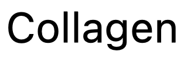
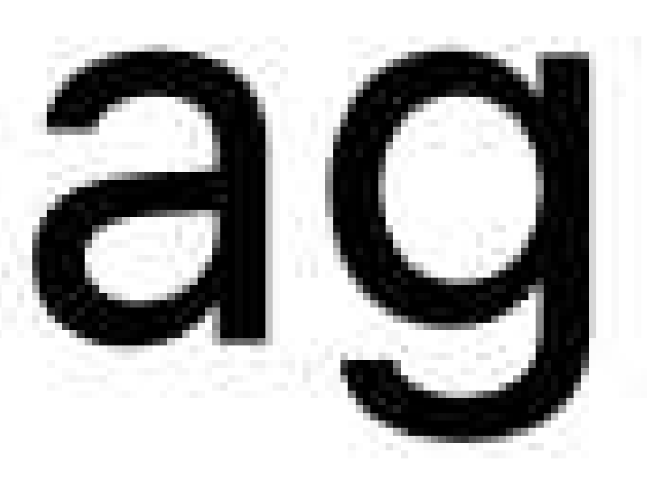
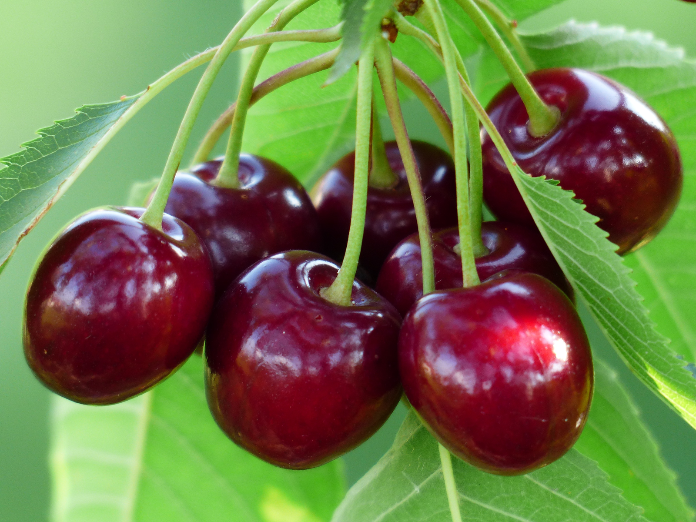

= Collagen — The Collage Generator
:nofooter:
:toc: macro
:!figure-caption:

image:https://img.shields.io/crates/v/collagen[link=https://crates.io/crates/collagen]

toc::[]

*_Collagen_* -- from “collage” and “generate” (and because
   https://en.wikipedia.org/wiki/Collagen[collagen] is the protein that holds your body together; `s/protein/tool/;s/body/images/`) -- is a program that takes as input a folder containing a JSON manifest file that describes the layout of any number of SVG elements (`<rect>`, `<line>`, `<g>`, etc.), image files (JPEG, PNG, etc.), other SVGs, and other Collagen folders, and produces as output a single SVG file with any external assets embedded.
That is, it converts a textual description of an SVG and any provided assets into a single portable SVG file.

In addition to mapping the manifest directly into SVG, Collagen supports a number of
features that make creating graphics more convenient for the author, such as variable assignment and interpolation into SVG attributes,
a LISP-like language to evaluate mathematical expressions inside strings, “if” tags to
conditionally generate elements, and “for-each” tags to generate sequences of elements.
For instance, the following manifest will create a rainbow pinwheel.

.`collagen.json`
[%collapsible]
====
[source,json]
----
{
	"vars": {
		"width": 100,
		"height": "{width}",
		"n-spokes": 16,
		"cx": "{(/ width 2)}",
		"cy": "{(/ height 2)}",
		"spoke-length": "{(* width 0.75)}"
	},
	"attrs": {
		"viewBox": "0 0 {width} {height}"
	},
	"children": [
		{
			"for_each": {
				"variable": "i",
				"in": { "start": 0, "end": "{n-spokes}" }
			},
			"do": {
				"tag": "line",
				"vars": {
					"theta": "{(* (/ i n-spokes) (pi))}",
					"dx": "{(* (/ spoke-length 2) (cos theta))}",
					"dy": "{(* (/ spoke-length 2) (sin theta))}"
				},
				"attrs": {
					"x1": "{(+ cx dx)}",
					"x2": "{(- cx dx)}",
					"y1": "{(+ cy dy)}",
					"y2": "{(- cy dy)}",
					"stroke": "hsl\\({(* (/ i n-spokes) 360)}, 100%, 50%\\)"
				}
			}
		}
	]
}
----
====

== Rationale

Creating and editing images is hard. Most of the difficulty is due to lack of programmatic facilities offered by image editing programs.
(I must caveat this by admitting I have not used every graphics editing program on the market.
But the ones I have tried fall short.)
Collagen aims to fill this gap in the following ways:

. Plain text is portable and trivially editable.
When editing an image is done by editing a text file, the only barrier to entry is knowing JSON, knowing the schema used by Collagen, and knowing the catalog of SVG elements.
In addition, a folder containing a text file and some images is simple to share: just zip it and send it along.
Finally, Collagen is nondestructive; all assets used in the final image are available in their original form right in that folder.
. While most image editing programs support “guides” and “snapping” that allow graphical elements to be precisely positioned relative to each other, there is no “glue” to hold the elements together indefinitely; moving one tends not to move the other.
For instance, an arrow pointing from a given corner of a rectangle to a fixed point cannot be made to have its tail always lie on that corner while leaving its head stationary.
Variables solve this problem by letting the author use the same variable(s) to specify the position of both the rectangle's corner and the arrowhead.
More generally, variables support the problem of keeping several values in sync without having to edit multiple hard-coded values.
. Image editing programs output a single image file which is of one of the well-known image types (JPEG, PNG, etc).
Different image formats are optimized for different
types of image data, and break down when made to store image data they weren't optimized for.
.. For instance, JPEG is optimized for images with smoothly varying gradients (which tends to mean photographs taken by a physical camera).
Therefore it produces images with ugly compression artifacts when made to store geometric shapes or text.
Below are a PNG image of some text, and that same PNG after conversion to JPEG.
The JPEG has been enlarged to make the compression artifacts more easily visible.
+
._A screenshot of the word “Collagen” in PNG format_
--

--
+
._A screenshot of the word “Collagen” in JPG format, zoomed in_
--

--

.. On the other hand, PNG is optimized for images with long runs of few distinct colors, and requires a massive file size to store the kind of data that JPEG is optimized for.
Despite displaying exactly the same image (https://commons.wikimedia.org/wiki/File:Cherry_sweet_cherry_red_fruit_167341.jpg[source]), the PNG file below is 6.6 times bigger than the JPEG.
+
._A JPEG, weighing in at 407KB_
--

--
+
._A PNG, weighing in at 2.7MB_
--

--
.. JPEGs and PNGs are both https://en.wikipedia.org/wiki/Raster_graphics[raster formats], which means they correspond to a rectangular grid of pixels.
A given raster image has a fixed resolution (given in, say, pixels per inch), which is, roughly speaking, the amount of detail present in the image.
When you zoom in far enough on a raster image, you'll be able see the individual pixels that comprise the image.
Meanwhile, https://en.wikipedia.org/wiki/Scalable_Vector_Graphics[vector graphics] store geometric objects such as lines, rectangles, ellipses, and even text, which have no resolution to speak of — you can zoom infinitely far on them and they'll always maintain that smooth, pixel-perfect appearance.
Without Collagen, if you want to, say, add some text on top of a JPEG, you have no choice to but to rasterize the text, converting the infinitely smooth shapes to a grid of pixels and losing the precision inherent in vector graphics.

+
Collagen fixes this by allowing JPEGs, PNGs, and any other images supported by browsers to coexist with each other and with vector graphic elements in an SVG file, leading to neither the loss in quality nor the increase in file size that arise when using the wrong image format.
(Collagen achieves this by simply base64-encoding the source images and embedding them directly into the SVG.)
. Creating several similar elements by hand is annoying, and keeping them in sync is even worse.
Collagen provides a `for_each` tag to programmatically create arbitrary numbers of elements, and the children elements can make use of the loop variable to control their behavior.
We saw this above in the pinwheel, which used the loop variable `i` to set the angle and color of each spoke.
The `for` loop itself had access to the `n-spokes` variable set at the beginning of the file, which goes back to point 2: variables make things easy.
. Why SVG at all?
Why not some other output image format?
** SVGs can indeed store vector graphics and the different kinds of raster images alongside each other.
** SVGs are widely compatible, as they're supported by nearly every browser.
** SVGs are "just" a tree of nodes with some attributes, so they're simple to implement.
** SVGs are written in XML, which is plain text and simple(-ish) to edit.

The above features make Collagen suitable as an “image editor for programmers”.

== Using Collagen

=== Quick Start

Install Collagen with `cargo install collagen`.
This will install the executable `clgn`.

Once installed, if you have a manifest file at path `path/to/collagen/manifest.json`, you can run the following command:

[source,bash]
----
clgn -i path/to/collagen -o output-file.svg
----

To continuously monitor the input folder and re-run on any changes, you can run Collagen in watch mode:

[source,bash]
----
clgn -i path/to/collagen -o output-file.svg --watch
----

In watch mode, every time a file in `path/to/collagen` is modified, Collagen will attempt to regenerate the output file and will either print a generic success message or log the specific error encountered, as the case may be.

https://rben01.github.io/collagen[This doc] has several examples that can serve as a good starting point for creating a manifest.
More examples are available as test cases in `tests/examples`.

=== Definitions

[horizontal]
Collagen:: The name of this project.
`clgn`:: The executable that does the conversion to SVG.
Skeleton:: A folder that is the input to `clgn`. It must contain a `collagen.json` file and any assets specified by `collagen.json`.
For instance, if skeleton `my_skeleton`'s `collagen.json` contains `{ "image_path": "path/to/image" }`, then `my_skeleton/path/to/image` must exist.
Manifest:: The `collagen.json` file residing at the top level inside a skeleton.

=== In-Depth Description

The input to Collagen is a folder containing, at the bare minimum, a _manifest_ file named `collagen.json`.
Such a folder will be referred to as a _skeleton_.
A manifest file is more or less a JSON-ified version of an SVG (which is itself XML), with some facilities to make common operations, such as for loops and including an image by path, more ergonomic.
For instance, without Collagen, in order to embed an image of yours in an SVG, you would have to base64-encode it and construct that image tag manually, which would look something like this:

[source,xml]
----
<image href="data:image/png;base64,iVBORw0KGgoAAAA...(many, many bytes omitted)..."></image>
----

In contrast, including an image in a Collagen manifest is as simple as including the following JSON object as a descendent of the root tag:

[source,json]
----
{ "image_path": "path/to/image" }
----

Collagen handles base64-encoding the image and constructing the `<image>` tag with the correct attributes for you.

=== Basic Schema

In order to produce an SVG from JSON, Collagen must know how to convert an object representing a tag into an actual SVG tag, including performing any additional work (such as base64-encoding an image).
Collagen identifies the type of an object it deserializes simply by the keys it contains.
For instance, the presence of the `"for_each"` property tells Collagen that this tag is a `for` loop tag, while the `"image_path"` property tells Collagen that this tag is an `<image>` tag with an associated image file to embed.
To avoid ambiguities, it is an error for an object to contain unexpected keys.

The recognized tags are listed at https://docs.rs/collagen/latest/collagen/fibroblast/tags/enum.AnyChildTag.html[docs.rs/collagen].

== Portability Concerns

In general, filesystem paths are not necessarily valid UTF-8 strings.
Furthermore, Windows and \*nix systems use different path separators.
How, then, does Collagen handle paths to files on disk in a platform-agnostic way?
All paths consumed by Collagen must be valid UTF-8 strings using forward slashes (`/`) as the path separator.
Forward slashes are replaced with the system path separator before resolving the path.
So `path/to/image` remains unchanged on \*nix systems, but becomes `path\to\image` on Windows.
This means that in order to be portable, path components should not contain the path separator of any system, even if it is legal on the system on which the skeleton is authored.
For instance, filenames with backslashes `\` are legal on Linux, but would pose a problem when decoding on Windows.
Generally speaking, if you restrict your file and folder names to use word characters, hyphens, whitespace, and a limited set of punctuation, you should be fine.

Naturally you are also limited by the inherent system limitations on path names.
For instance, while `CON` is a valid filename on Linux, it is forbidden by Windows.
Collagen makes no effort to do filename validation on behalf of systems on which it may be used; it is up to the author of a skeleton to ensure that it can be decoded on a target device.
